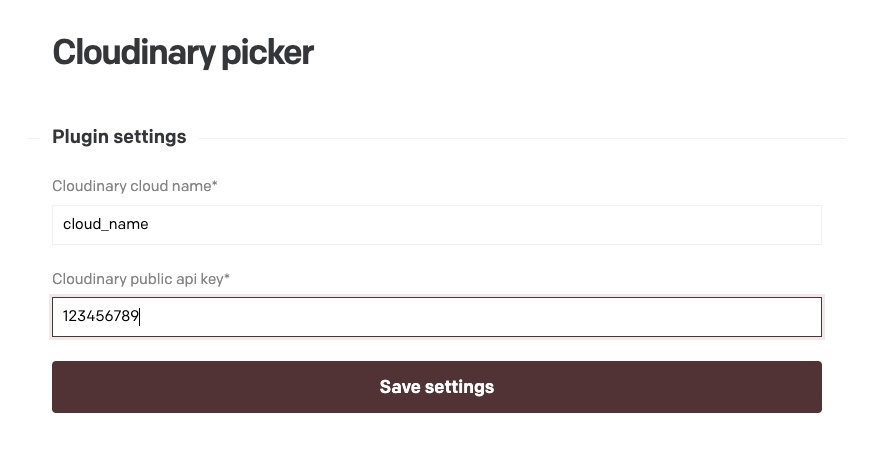
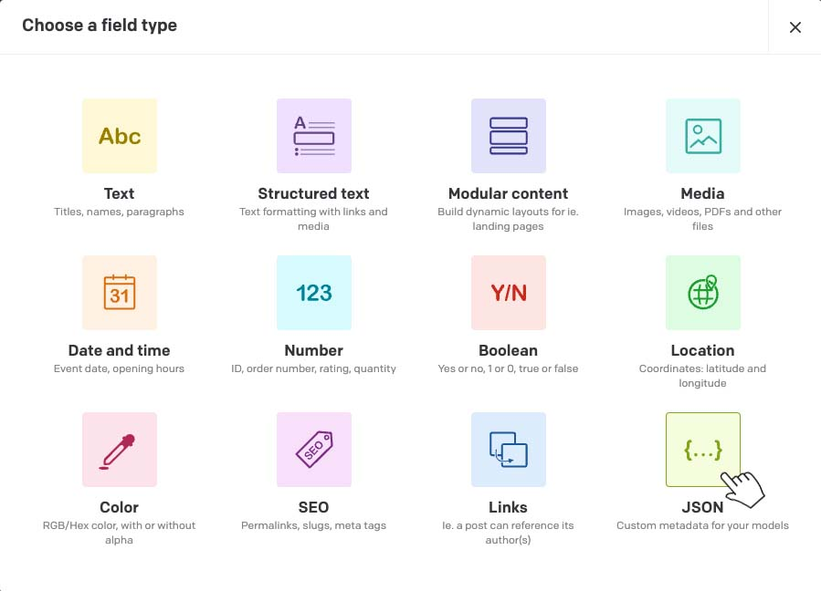
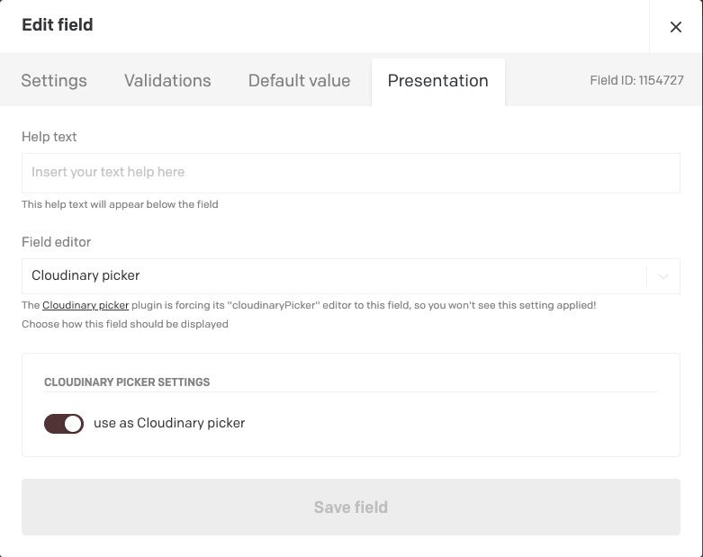
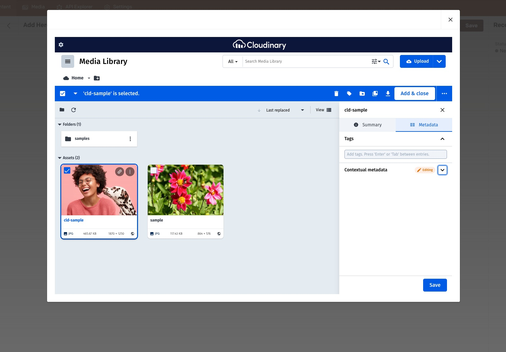

# DatoCMS Cloudinary picker

A plugin that turns a JSON field into a Cloudinary picker\
Including Focal point picker

## Configuration

Configure the plugin with Cloudinary cloud name & Cloudinary public api key

Users will still need to separately log into Cloudinary when the widget opens, unless they have previously logged in via the Cloudinary console

Plugin config

Choose JSON field type

Choose use as cloudinary picker in presentation

Field in action

